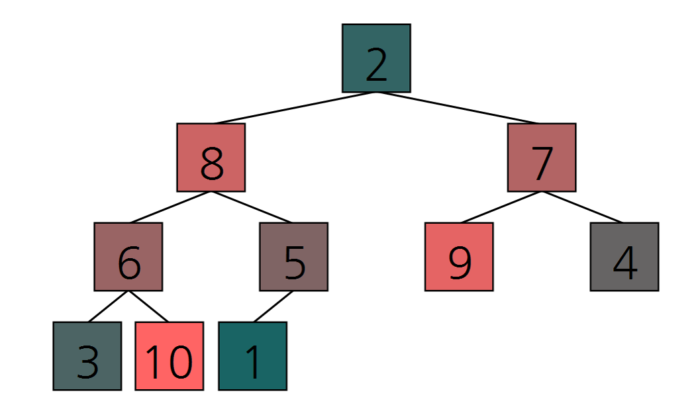

# Heap_sort_visualization
힙 정렬(Heap sort) 알고리즘 시각화

**구현 영상**

[](http://www.youtube.com/watch?v=uq0a4NLI0IU)

## 0. 그대로 실행 시 주의사항
그대로 실행 시, 하위 디렉토리 ```\frames``` 를 생성하고 학습 내용에 대해 모두 저장하도록 되어 있습니다.
수많은 파일을 생성하고 싶지 않다면, ```Sort_visualization.cs``` 에서 ```Sort_visual```클래스의  ```save_frame()``` 함수를 수정하세요.

## 1. 힙 정렬(Heap sort)
**힙 정렬**

 힙 정렬(Heap sort)은 정렬 알고리즘 중 하나다. 선택 정렬(Selection sort)과 같이 정렬된 부분과 정렬되지 않은 부분으로 나누고, 정렬되지 않은 부분에 최대 힙(Max-Heap) 또는 최소 힙(Min-Heap) 자료구조를 사용하여 최댓값 또는 최솟값을 정렬된 부분으로 넘기는 과정을 통해 정렬을 수행한다.

**시간 복잡도**

최선의 경우 : 


최악의 경우 : 


**의사코드**


## 2. 시각화 방법
**힙 구조 시각화 시각화**

 완전 이진 트리 형태로 표현



**배열 원소 수치 시각화**

 수치에 비례하게 원소의 색을 표현


**배열 원소 상태 시각화**


